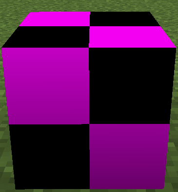

# はじめに

`IBakedModel`とか`TileEntitySpecialRenderer`などに関する解説記事があんまりないなーと思ったので、書いてみる。
今回は`IBakedModel`を扱う。

アイテム/ブロックの追加などの基本的な部分については扱わない。素晴らしい記事がインターネット上にたくさんあるので、そちらを参照して欲しい。

:::tip[環境構築Tips]
今から1.12.2でModdingをする場合、[CleanroomMC/TemplateDevEnv](https://github.com/CleanroomMC/TemplateDevEnv)を使うと簡単に環境を構築できる([Kotlin用](https://github.com/CleanroomMC/TemplateDevEnvKt)もある)。
[GregTechCEu/Buildscripts](https://github.com/GregTechCEu/Buildscripts)も参考になると思う。
:::

## 前提知識

Javaの基本知識や、アイテム/ブロックの追加など基本的なModdingの知識があることを前提にする。

# `IBakedModel`とはなに?

普通、ブロックのテクスチャはjsonファイルで指定する。
この方法でも、BlockStateに対して1つモデルが紐づけられ、16種類以下の状態数を持つブロックであれば事足りる。
実際、バニラの大釜のモデルはこの方式で定義されている。

```json title="cauldron.json"
{
  "variants": {
    "level=0": { "model": "cauldron_empty" },
    "level=1": { "model": "cauldron_level1" },
    "level=2": { "model": "cauldron_level2" },
    "level=3": { "model": "cauldron_level3" }
  }
}
```

しかし、TileEntityの状態に応じてレンダリングを行いたい場合などは、この方法では対応できない。
そのような場合には`TileEntitySpecialRenderer`(TESR)や`IBakedModel`を使う。

今回は`IBakedModel`について、隣のブロックの見た目になるブロックを作りながら解説する。

`IBakedModel`は、TESRと同じように動的なレンダリングを行うものである。
TESRが"active"にTileEntityを描画するのに対し、`IBakedModel`は"passive"に行う。
つまり、TESRの`render`メソッドは常に呼ばれ続けるが、`IBakedModel`の`getQuads`メソッドは、TileEntityの状態に変化があった時や周りのブロックが変更された時などにのみ呼ばれる。

# 作ってみる

まずは、`IBakedModel`を実装して、読み込まれるようにする。

`IBakedModel`を実際に使うには、ほかに`IModel`と`ICustomModelLoader`を実装する必要がある。
まずは、それら2つを実装してみよう。

なお、このへんの話は[Forge Docs](https://docs.minecraftforge.net/en/1.12.x/models/advanced/introduction/)が結構詳しかったりするので、一度読んでみることを推奨する。ただ、`BakedQuad`をどう生成するかなどの話はない。

## `ICustomModelLoader`の実装

```java title="ExampleModelLoader.java"
public class ExampleModelLoader implements ICustomModelLoader {
    @Override
    public void onResourceManagerReload(@Nonnull IResourceManager resourceManager) {

    }

    @Override
    public boolean accepts(@Nonnull ResourceLocation modelLocation) {
        return modelLocation.getNamespace().equals("examplemod");
    }

    @Override
    @Nonnull
    public IModel loadModel(@Nonnull ResourceLocation modelLocation) throws Exception {
        return new ExampleModel();
    }
}
```

- `onResourceManagerReload`は、F3+Tでテクスチャ再読み込みを行った時に呼ばれる。
  今回は特に何もしない。本来は、キャッシュしているテクスチャやモデルをクリアするなどの処理を行う。
- `accepts`は、どの対象をこのローダーで読み込むかどうかを決定する。
  今回は単純に、このModが追加したものなら読み込むようにしている。
- `loadModel`は、実際に描画するモデルを返す。
  `onResourceManagerReload`で`IResourceManager`を取得しておけば、ファイルを読むということも可能である。

作ったら、`ModelLoaderRegistry.registerLoader`で登録しておこう。
登録するタイミングは`preInit`で問題ない。

## `IModel`

```java title="ExampleModel.java"
public class ExampleModel implements IModel {
    @Override
    public IBakedModel bake(IModelState state, VertexFormat format, Function<ResourceLocation, TextureAtlasSprite> bakedTextureGetter) {
        return new ExampleBakedModel(ModelLoaderRegistry.getMissingModel().bake(state, format, bakedTextureGetter));
    }
}
```
  
- `bake`は、実際に`IBakedModel`を生成する。
  `bakedTextureGetter`は`BakedQuad`を生成する際に必要なので、保存しておくと良い。

また、デフォルト実装があるので今回Overrideしていないが、重要なメソッドが2つある。
- `getDependencies`: 先に読み込んでおいて欲しいモデルのコレクションを返す。
  もし、依存するモデルがあるのなら利用しよう。
- `getTextures`: 読み込んで欲しいテクスチャファイルのコレクションを返す。
  普通のjsonモデルと違い、ここでテクスチャを指定しないと読み込まれないので注意しよう。

## `IBakedModel`実装

いよいよ本題に入ろう。

とりあえず、コンストラクタで受け取るmodelそのままになるようなものを作ってみよう。

```java title="ExampleBakedModel.java"
public class ExampleBakedModel implements IBakedModel {

    private final IBakedModel baseModel;

    public ExampleBakedModel(IBakedModel baseModel) {
        this.baseModel = baseModel;
    }

    @Override
    public List<BakedQuad> getQuads(@Nullable IBlockState state, @Nullable EnumFacing side, long rand) {
        return baseModel.getQuads(state, side, rand);
    }

    @Override
    public boolean isAmbientOcclusion() {
        return true;
    }

    @Override
    public boolean isGui3d() {
        return true;
    }

    @Override
    public boolean isBuiltInRenderer() {
        return false;
    }

    @Override
    public TextureAtlasSprite getParticleTexture() {
        return baseModel.getParticleTexture();
    }

    @Override
    public ItemOverrideList getOverrides() {
        return baseModel.getOverrides();
    }
}
```

適当なブロックを追加して、ワールドに設置してみよう。すると、以下のようなモデルが描画される。

